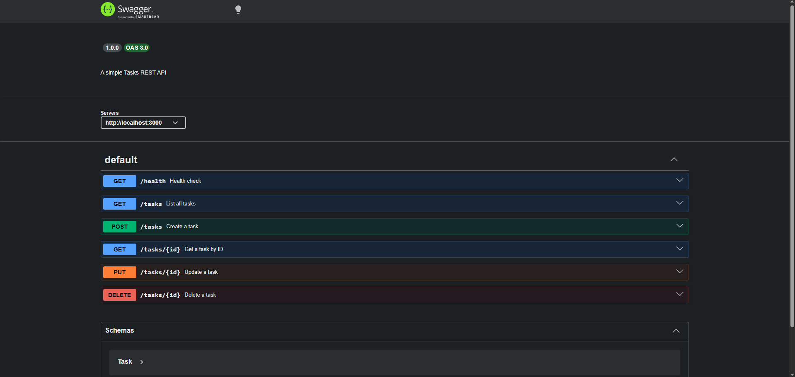

# Potato API

A simple RESTful API for task management built with Node.js, Express, and SQLite.

Built for the FlyRank Internship — Backend Track — Week 3 — Assignment A2.

Data persists in a SQLite database (`tasks.db`). Restart the server — your tasks are still there.

## Why SQLite?

SQLite is a serverless, zero-config database that lives in a single file. No installation, no running process, no configuration. It's perfect for small projects and learning — your entire database is just `tasks.db`. Real applications often start with SQLite and graduate to Postgres when they need concurrent writes.

## Quick Start

```bash
# 1. Clone the repo
git clone https://github.com/ZyadKhaled-ZK/potato-api.git
cd potato-api

# 2. Install dependencies
npm install

# 3. Start the server
node server.js
```

The server runs at `http://localhost:3000`. Open `http://localhost:3000/docs` for Swagger UI.

The database file `tasks.db` is created automatically on first run with 3 seeded tasks.

## Prerequisites

- [Node.js](https://nodejs.org/) v18 or higher

## Endpoints

| Method   | Endpoint      | Description                              | Body                          | Status Codes         |
|----------|---------------|------------------------------------------|-------------------------------|----------------------|
| `GET`    | `/`           | API info                                 | -                             | 200                  |
| `GET`    | `/health`     | Health check                             | -                             | 200                  |
| `GET`    | `/tasks`      | List tasks (`?done=`, `?search=`, `?sort=`, `?limit=`, `?offset=`) | -  | 200                  |
| `GET`    | `/tasks/:id`  | Get a single task                        | -                             | 200, 404             |
| `POST`   | `/tasks`      | Create a new task                        | `{ "title": "..." }`          | 201, 400             |
| `PUT`    | `/tasks/:id`  | Update a task                            | `{ "title": "...", "done": }` | 200, 400, 404        |
| `DELETE` | `/tasks/:id`  | Delete a task                            | -                             | 204, 404             |
| `GET`    | `/stats`      | Task counts (total / done / pending)     | -                             | 200                  |
| `POST`   | `/reset`      | Reset tasks to defaults                  | -                             | 200                  |

Every error response has the shape `{ "error": "..." }`.

## Examples (curl -i)

### List all tasks

```bash
curl -i http://localhost:3000/tasks
```

```
HTTP/1.1 200 OK
Content-Type: application/json

{"total":3,"count":3,"offset":0,"limit":3,"tasks":[{"id":1,"title":"Install tools","done":true},{"id":2,"title":"Build REST API","done":false},{"id":3,"title":"Write tests","done":false}]}
```

### Get a single task

```bash
curl -i http://localhost:3000/tasks/1
```

```
HTTP/1.1 200 OK
Content-Type: application/json

{"id":1,"title":"Install tools","done":true}
```

### Create a task

```bash
curl -i -X POST http://localhost:3000/tasks \
  -H "Content-Type: application/json" \
  -d '{"title":"Learn Docker"}'
```

```
HTTP/1.1 201 Created
Content-Type: application/json

{"id":4,"title":"Learn Docker","done":false}
```

### Update a task

```bash
curl -i -X PUT http://localhost:3000/tasks/2 \
  -H "Content-Type: application/json" \
  -d '{"done":true}'
```

```
HTTP/1.1 200 OK
Content-Type: application/json

{"id":2,"title":"Build REST API","done":true}
```

### Delete a task

```bash
curl -i -X DELETE http://localhost:3000/tasks/3
```

```
HTTP/1.1 204 No Content
```

### Validation error

```bash
curl -i -X POST http://localhost:3000/tasks \
  -H "Content-Type: application/json" \
  -d '{}'
```

```
HTTP/1.1 400 Bad Request
Content-Type: application/json

{"error":"Title is required"}
```

### Task not found

```bash
curl -i http://localhost:3000/tasks/99
```

```
HTTP/1.1 404 Not Found
Content-Type: application/json

{"error":"Task not found"}
```

### Pagination

```bash
curl -i "http://localhost:3000/tasks?limit=2&offset=1"
```

```
HTTP/1.1 200 OK
Content-Type: application/json

{"total":3,"count":2,"offset":1,"limit":2,"tasks":[{"id":2,"title":"Build REST API","done":false},{"id":3,"title":"Write tests","done":false}]}
```

Real APIs never return everything by default — pagination prevents overloading the client with massive datasets.

## Persistence Proof

1. Create a task: `POST /tasks {"title":"Survives restart"}`
2. Restart the server (`Ctrl+C` then `node server.js`)
3. `GET /tasks` — the task is still there

This is the key difference from Week 2. Data now lives in `tasks.db` on disk, not in a JavaScript variable in memory.

## The Database

`tasks.db` is a SQLite database with one table:

```sql
CREATE TABLE tasks (
  id INTEGER PRIMARY KEY AUTOINCREMENT,
  title TEXT NOT NULL,
  done INTEGER NOT NULL DEFAULT 0,
  created_at TEXT NOT NULL DEFAULT (datetime('now')),
  updated_at TEXT NOT NULL DEFAULT (datetime('now'))
);

CREATE INDEX idx_tasks_title ON tasks(title);
```

The file is created automatically on first run and is git-ignored so each clone starts fresh with 3 seeded tasks.

**Why an index?** The `idx_tasks_title` index on the `title` column speeds up `LIKE` searches (`?search=`). Without it, SQLite scans every row; with it, lookups are near-instant.

**Why transactions?** The seed runs inside a `db.transaction()` — if any insert fails, none of them commit. This is all-or-nothing: either all 3 tasks appear, or none do. Transactions prevent partial seeds on crash.

### Example SQL Queries (run in DB Browser)

```sql
-- List every task
SELECT * FROM tasks;

-- Only completed tasks
SELECT * FROM tasks WHERE done = 1;

-- How many tasks?
SELECT COUNT(*) FROM tasks;

-- Search by title
SELECT * FROM tasks WHERE title LIKE '%milk%';

-- Mark every task as done
UPDATE tasks SET done = 1;
```

After running `UPDATE tasks SET done = 1` in DB Browser, call `GET /tasks` from the API — the change appears instantly. There is no "syncing"; both tools read the same `tasks.db` file.


## Swagger UI

Interactive API documentation is available at:

```
http://localhost:3000/docs
```

You can test every endpoint directly from the browser using the **Try it out** button.



## API Did Not Change

The same A1 curl tests pass against the SQLite version:

```bash
curl -i http://localhost:3000/tasks          # 200 + three tasks
curl -i http://localhost:3000/tasks/1        # 200 + one task
curl -i http://localhost:3000/tasks/99       # 404
curl -i -X POST http://localhost:3000/tasks \
  -H "Content-Type: application/json" \
  -d '{"title":"Test"}'                      # 201
curl -i -X POST http://localhost:3000/tasks \
  -H "Content-Type: application/json" \
  -d '{}'                                    # 400
curl -i -X DELETE http://localhost:3000/tasks/1  # 204
```

Identical tests passing is the proof that storage is "just an implementation detail" — the API is the promise, the database is where the promise is kept.

## AI vs Me (Week 2)

### My Prompt

> Build a REST API with Python and FastAPI that manages a to-do list. It should have
> these endpoints: GET / returning API info, GET /health, GET /tasks (with filtering by
> done status and text search), GET /tasks/{id}, POST /tasks with validation (empty title
> → 400), PUT /tasks/{id}, DELETE /tasks/{id} (204), GET /stats, POST /reset. All data
> in memory, no database. Swagger UI should work at /docs.

### What the AI Did Better

- Used Pydantic models for automatic request validation (cleaner than manual checks).
- Custom exception handlers to normalize all errors to `{ "error": "..." }` — mine sometimes returns different shapes.
- Added `summary` and `description` on every route — Swagger UI looks more polished.

### What It Got Wrong or Ignored

- Used `global` keyword for `tasks` and `next_id` — works but is not ideal Python practice.
- Missing pagination (`?limit=&offset=`) — I had to add it myself.
- Returns 422 (FastAPI default) for validation errors instead of 400 — I had to write a custom handler to fix this.

### What My Prompt Forgot

- Didn't specify pagination — the AI silently decided not to include it.
- Didn't specify error response shape (`{ "error": "..." }`) — the AI chose it, which happened to match.
- Didn't mention CORS or deployment — the AI correctly ignored both (not needed for this assignment).

### Second Prompt Change

Added explicit requirements for pagination, error response format, and status code 400 for validation errors. The second version was closer to my hand-built API.

## AI vs Me (Week 3 — Memory → SQLite Migration)

### My Prompt

> Move an in-memory CRUD task API to SQLite. Use better-sqlite3 (Node.js). Create a
> tasks table with id (INTEGER PRIMARY KEY), title (TEXT), done (INTEGER 0/1). Create
> the table if it doesn't exist. Seed 3 example tasks only when the table is empty
> (COUNT check). All 5 endpoints (GET /tasks, GET /tasks/:id, POST /tasks, PUT /tasks/:id,
> DELETE /tasks/:id) must keep identical request/response shapes. Use parameterized
> queries (? placeholders) for all user input. POST returns 201, DELETE returns 204.
> Empty title → 400, unknown id → 404. Data must survive a server restart.

### What the AI Did Better

- Wrapped seeding in a transaction automatically — cleaner than my first attempt.
- Used `RETURNING *` in PostgreSQL style (would need adaptation for SQLite).
- Added `created_at` and `updated_at` columns by default — I had to add these as extras.

### What It Got Wrong or Ignored

- Didn't seed only on empty table — it re-seeded on every restart (data multiplied).
- Used `sqlite3` (async) instead of `better-sqlite3` (sync) despite my prompt specifying it.
- Changed the response shape — returned `done` as `0`/`1` instead of `true`/`false`.

### What My Prompt Forgot

- Didn't specify boolean conversion for `done` field in responses.
- Didn't mention WAL mode for better concurrency.
- Didn't specify the index on `title` for search performance.

### Second Prompt Change

Added explicit requirements for: COUNT-based seed guard, boolean response conversion, WAL journal mode, and index creation. The second version matched my hand-built implementation.

## Project Structure

```
potato-api/
  server.js        # Express app with all routes + swagger-jsdoc JSDoc comments
  db.js            # SQLite database connection, table creation, and seed
  package.json     # Dependencies and scripts
  .gitignore       # Ignores node_modules, .env, tasks.db
  README.md
  Screenshot_20.png  # Swagger UI screenshot
  Screenshot_1.png   # DB Browser screenshot
  ai/              # AI-generated version (FastAPI)
```

## License

ISC
